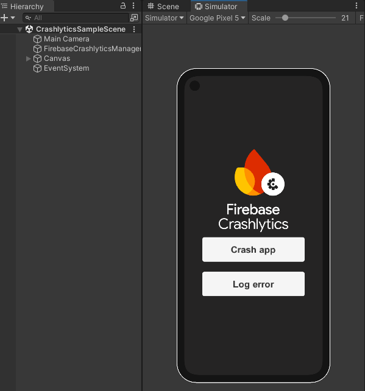
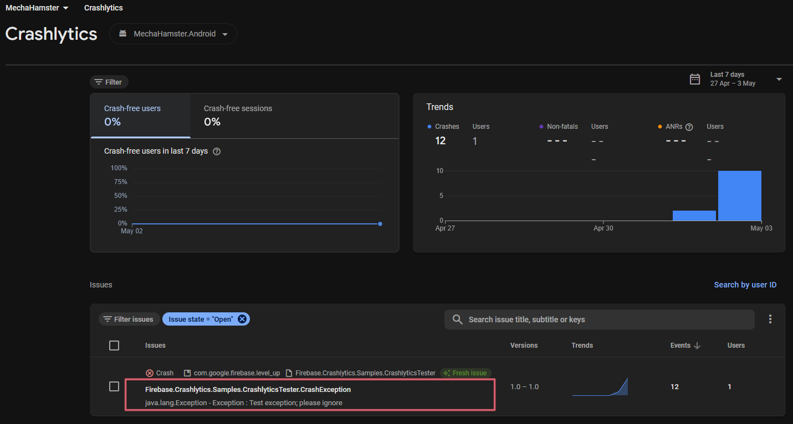
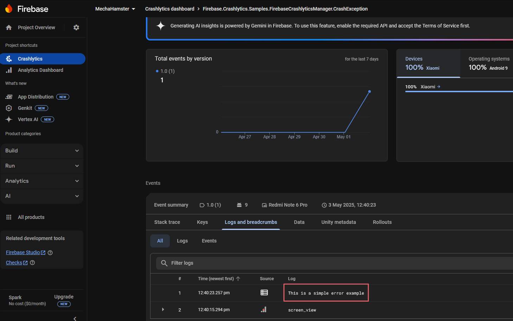

# Firebase Crashlytics Sample

This sample contains:

- `FirebaseCrashlyticsManager` game object attached with a sample script that handle the **`FirebaseApp`** initialization.

- A **scene** file [CrashlyticsSampleScene.unity](./Scenes/CrashlyticsSampleScene.unity) with a buttons that send crashes and errors to [Crashlytics dashboard](https://console.firebase.google.com/u/0/project/_/crashlytics) cloud.

Use this sample here as a *"**Getting Started**"*, to understand how to use **Firebase Crashlytics** with Unity and check if the
cloud comunication is working properly outside of your project. This is useful if your game project is large, with several scripts
and files to recompile on each change!

## Screenshots

## Getting started

1. From Unity Editor, open the scene file [CrashlyticsSampleScene.unity](./Scenes/CrashlyticsSampleScene.unity)
2. Generate a mobile build (Android or IOS), install and run in your device
   > **Warning:** For now, Deskto/WebGL builds aren't working with Crashlytics example here.

   > If you try press *"**Play**"* button on Editor, it will try use the `mobilesdk_app_id`, `project_id` etc.. from **`/Assets/StreamingAssets/google-services-desktop.json`** generated file,
   but the events aren't being logged on Crashlytics cloud :(

3. Press the button "*Crash app*". After that, close/reopen the game app in order to crash exception be send to the cloud
4. Press the button "*Log error*".
5. You should see a crash and/or log like this on [Crashlytics dashboard](https://console.firebase.google.com/project/_/crashlytics)

   

   
